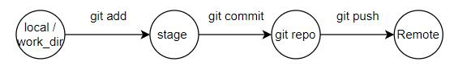
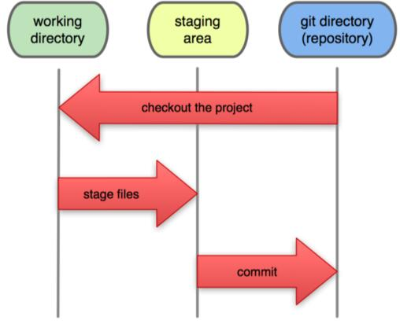
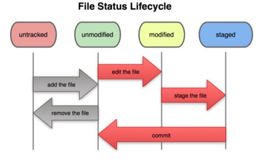

# git基本流程

- git diff： 比较local和stage区别（适用于查找local修改但未add到stage的代码部分)

- add用于建立index快照文件（也称为快照文件存入stage暂存区)

- commit是将stage的快照文件持久化到.git的objects目录下，即产生一个xx文件，同时在.git/refs/heads目录下的main文件中写入该objects/xx文件的文件名

``可见，git使用文件的增量保存策略``
# 文件状态的生命周期

- 文件状态的改变要add到暂存区，从而实现对文件状态的追踪。
- 该图揭示暂存区的作用，当commit后，创建objects持久化文件就清空暂存区。