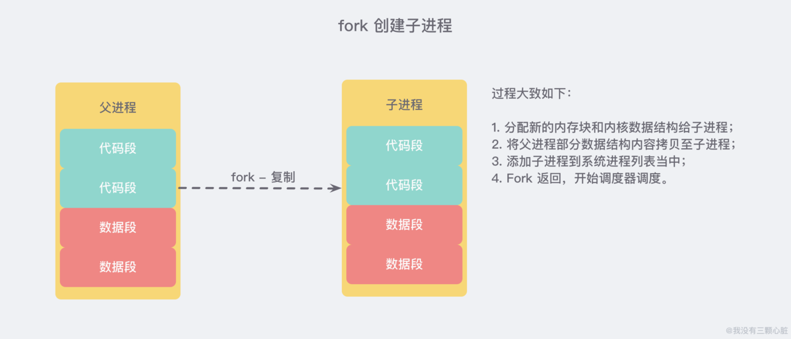

# redis1.0采用RDB持久化

 RDB 将数据库的快照（snapshot）以二进制的方式保存到磁盘中

> Redis 快照 是最简单的 Redis 持久性模式。当满足特定条件时，它将生成数据集的时间点快照，例如，如果先前的快照是在2分钟前创建的，并且现在已经至少有 100 次新写入，则将创建一个新的快照。此条件可以由用户配置 Redis 实例来控制，也可以在运行时修改而无需重新启动服务器。快照作为包含整个数据集的单个 .rdb 文件。

但是这存在两个问题

- 写入性能
- 写入过程，结构改变怎么办

# fork写时复制

 问题的解决是使用 fork 函数，使得由子线程来进行写入操作，fork 函数使用了我们熟悉的COW(Copy-On-Write)机制

> 所以 快照持久化 可以完全交给 子进程 来处理，父进程 则继续 处理客户端请求。子进程 做数据持久化，它 不会修改现有的内存数据结构，它只是对数据结构进行遍历读取，然后序列化写到磁盘中。但是 父进程 不一样，它必须持续服务客户端请求，然后对 内存数据结构进行不间断的修改。

> 这个时候就会使用操作系统的 COW 机制来进行 数据段页面 的分离。数据段是由很多操作系统的页面组合而成，当父进程对其中一个页面的数据进行修改时，会将被共享的页面复 制一份分离出来，然后 对这个复制的页面进行修改。这时 子进程 相应的页面是 没有变化的，还是进程产生时那一瞬间的数据。

> 子进程因为数据没有变化，它能看到的内存里的数据在进程产生的一瞬间就凝固了，再也不会改变，这也是为什么 Redis 的持久化 叫「快照」的原因。接下来子进程就可以非常安心的遍历数据了进行序列化写磁盘了。

# RDB问题

 RDB needs to fork() often in order to persist on disk using a child process. Fork() can be time consuming if the dataset is big, and may result in Redis to stop serving clients for some millisecond or even for one second if the dataset is very big and the CPU performance not great. AOF also needs to fork() but you can tune how often you want to rewrite your logs without any trade-off on durability

#

