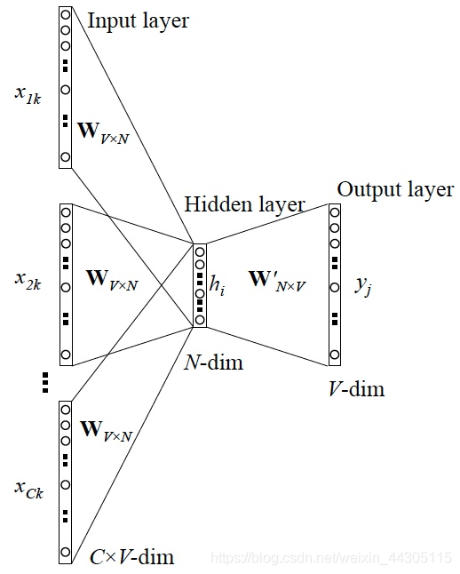

# word2vec关键问题
## 如何将词向量化的？
根据词排序后的字典索引和网络层数计算syn0向量，实现向量化
## 词袋模型
神经网络语言模型采用的方法一般是三层的神经网络结构（当然也可以多层），分为输入层，隐藏层和输出层(softmax层)。

- 图中的V表示文档词汇表的大小，也即单词的维度(单词维度与词汇表大小一致)，k表示第几个中心词(k<V)，C表示中心词的上下文单词数量，也就是窗口的2倍，N表示我们希望生成的稠密词向量的维度。
CBOW模型的训练输入是某一个中心词的上下文相关的词对应的词向量，而输出就是这中心词的词向量。比如下面这段话，结合上图的CBOW训练图，

这里我们可以看到，原来我们使用one-hot编码产生的词向量，词汇表中的每个单词都是1*V的向量，现在我们训练出look up table矩阵后，词汇表便可以使用一个矩阵完全表示了。
通过不断喂样本给上述CBOW模型，我们训练出比较合适的输入和输出权重矩阵。这样当我们有新的需求，要求出某8个词对应的最可能的输出中心词时，我们可以通过一次神经网络前向传播算法并通过softmax处理找到概率最大的词即可。

## 原文链接：https://blog.csdn.net/weixin_44305115/article/details/100545538
```c
if (cbow) {  //train the cbow architecture
      // in -> hidden
      cw = 0;
      for (a = b; a < window * 2 + 1 - b; a++) if (a != window) {
        c = sentence_position - window + a;
        if (c < 0) continue;
        if (c >= sentence_length) continue;
        last_word = sen[c];
        if (last_word == -1) continue;
        for (c = 0; c < layer1_size; c++) neu1[c] += syn0[c + last_word * layer1_size];    //last_word是词索引
        cw++;
      }
      if (cw) {
        for (c = 0; c < layer1_size; c++) neu1[c] /= cw;
        if (hs) for (d = 0; d < vocab[word].codelen; d++) {
          f = 0;
          l2 = vocab[word].point[d] * layer1_size;
          // Propagate hidden -> output
          for (c = 0; c < layer1_size; c++) f += neu1[c] * syn1[c + l2];
          if (f <= -MAX_EXP) continue;
          else if (f >= MAX_EXP) continue;
          else f = expTable[(int)((f + MAX_EXP) * (EXP_TABLE_SIZE / MAX_EXP / 2))];
          // 'g' is the gradient multiplied by the learning rate
          g = (1 - vocab[word].code[d] - f) * alpha;
          // Propagate errors output -> hidden
          for (c = 0; c < layer1_size; c++) neu1e[c] += g * syn1[c + l2];
          // Learn weights hidden -> output
          for (c = 0; c < layer1_size; c++) syn1[c + l2] += g * neu1[c];
        }
        // NEGATIVE SAMPLING
        if (negative > 0) for (d = 0; d < negative + 1; d++) {
          if (d == 0) {
            target = word;
            label = 1;
          } else {
            next_random = next_random * (unsigned long long)25214903917 + 11;
            target = table[(next_random >> 16) % table_size];
            if (target == 0) target = next_random % (vocab_size - 1) + 1;
            if (target == word) continue;
            label = 0;
          }
          l2 = target * layer1_size;
          f = 0;
          for (c = 0; c < layer1_size; c++) f += neu1[c] * syn1neg[c + l2];
          if (f > MAX_EXP) g = (label - 1) * alpha;
          else if (f < -MAX_EXP) g = (label - 0) * alpha;
          else g = (label - expTable[(int)((f + MAX_EXP) * (EXP_TABLE_SIZE / MAX_EXP / 2))]) * alpha;
          for (c = 0; c < layer1_size; c++) neu1e[c] += g * syn1neg[c + l2];
          for (c = 0; c < layer1_size; c++) syn1neg[c + l2] += g * neu1[c];
        }
        // hidden -> in
        for (a = b; a < window * 2 + 1 - b; a++) if (a != window) {
          c = sentence_position - window + a;
          if (c < 0) continue;
          if (c >= sentence_length) continue;
          last_word = sen[c];
          if (last_word == -1) continue;
          for (c = 0; c < layer1_size; c++) syn0[c + last_word * layer1_size] += neu1e[c];    //核心是得到syn0向量
        }
      }
    }
```

